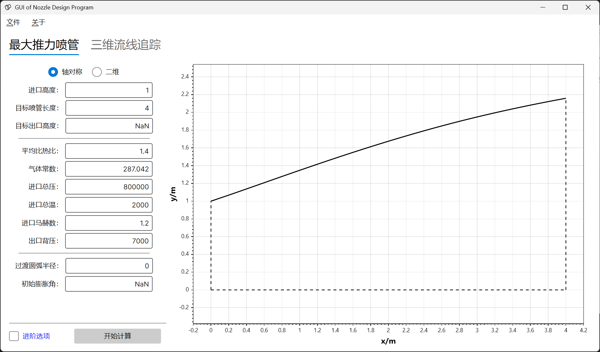
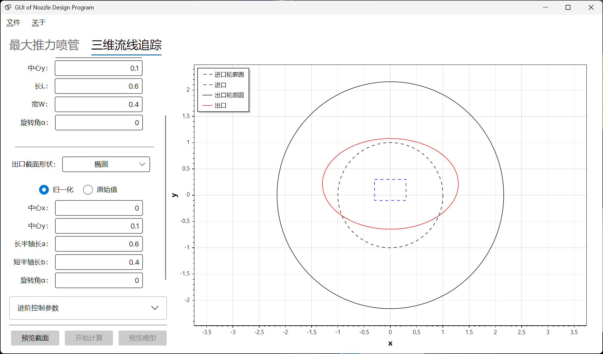
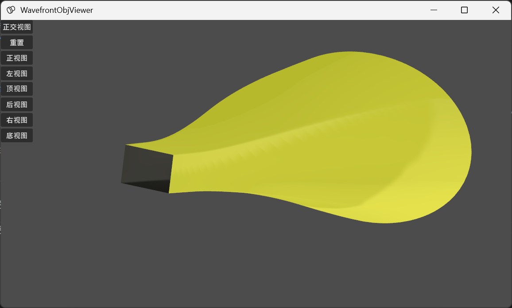
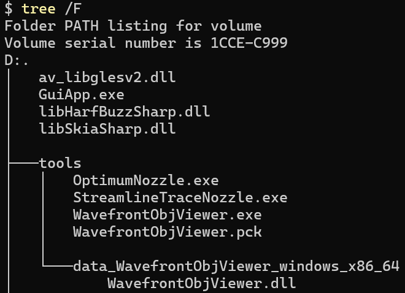

# nozzle-design-cs

基于 **Avalonia** 框架开发的超声速喷管扩张段设计桌面 GUI 应用程序，作为 [nozzle-design-rs](https://github.com/huarkiou/nozzle-design-rs) 的可视化前端，提供 **最大推力喷管 (OTN)** 与 **三维流线追踪喷管 (SLTN)** 的参数化设计与实时预览功能。

## 相关仓库

| 仓库 | 说明 |
|------|------|
| [nozzle-design-rs](https://github.com/huarkiou/nozzle-design-rs) | Rust 计算后端，基于特征线法 (MOC) 的喷管设计引擎 |
| [objviewer](https://github.com/huarkiou/objviewer) | 三维 OBJ 模型查看器，用于喷管型面预览 |

---

## 目录

- [项目简介](#项目简介)
- [依赖关系](#依赖关系)
- [项目架构](#项目架构)
- [功能概览](#功能概览)
  - [最大推力喷管 (OTN)](#最大推力喷管-otn)
  - [三维流线追踪喷管 (SLTN)](#三维流线追踪喷管-sltn)
- [技术栈](#技术栈)
- [构建与运行](#构建与运行)
- [使用方法](#使用方法)
- [配置参考](#配置参考)
- [项目结构](#项目结构)

---

## 项目简介

本程序是 [nozzle-design-rs](https://github.com/huarkiou/nozzle-design-rs) 的 C# 图形化前端。核心喷管设计计算由 Rust 编写的命令行程序 `otn.exe` 与 `sltn.exe` 完成，GUI 程序负责：

- 提供直观的参数输入界面（滑块、文本框、文件选择器）
- 生成 TOML 配置文件并调用 Rust 后端执行计算
- 实时预览二维喷管型面与截面轮廓
- 导出计算结果（`.dat` 格式用于 UG NX，`.obj` 格式用于三维查看）
- 调用 `objviewer.exe` 进行三维模型预览

## 依赖关系

```
┌─────────────────────────┐
│  nozzle-design-cs (本仓库) │  ← C# Avalonia GUI 前端
│  Corelib / GuiApp       │
└──────────┬──────────────┘
           │ 子进程调用
           ▼
┌─────────────────────────┐
│  nozzle-design-rs       │  ← Rust 计算后端
│  otn.exe / sltn.exe     │    基于特征线法 (MOC)
└─────────────────────────┘
```

本仓库不直接引用 Rust 库源代码，而是通过子进程调用编译好的可执行文件：

| 可执行文件 | 用途 |
|-----------|------|
| `otn.exe` | 二维轴对称/平面最大推力喷管型面设计 |
| `sltn.exe` | 三维流线追踪喷管设计 |
| `objviewer.exe` | 三维 OBJ 模型预览（[objviewer](https://github.com/huarkiou/objviewer)） |

这些文件应放置在 `./tools/` 目录下（Release 模式），或在 Debug 模式下通过硬编码路径指向 `nozzle-design-rs` 的编译输出目录。

## 项目架构

```
nozzle-design-cs/
├── Corelib/                         # 核心几何库（类库项目）
│   ├── Corelib.csproj               # .NET 10.0 类库
│   └── Geometry/
│       ├── Point.cs                 # 二维点结构体（含向量运算、极坐标变换）
│       ├── IClosedCurve.cs          # 闭合曲线接口
│       ├── Circle.cs                # 圆形截面
│       ├── Ellipse.cs               # 椭圆截面（含旋转，Broyden 求根）
│       ├── SuperEllipse.cs          # 超椭圆截面（幂次 n，Broyden 求根）
│       ├── Rectangular.cs           # 矩形截面（含旋转）
│       ├── Polygon.cs               # 自定义多边形截面
│       ├── Ray2D.cs                 # 二维射线（射线-线段交点求解）
│       └── Segment2D.cs             # 二维线段
├── GuiApp/                          # Avalonia GUI 主程序
│   ├── Program.cs                   # 程序入口（Avalonia AppBuilder）
│   ├── App.axaml / App.axaml.cs     # 应用配置（Serilog 日志、DI 容器）
│   ├── GuiApp.csproj                # WinExe，Native AOT 发布
│   ├── Models/
│   │   ├── CrossSectionPosition.cs  # 截面位置枚举（Inlet / Outlet）
│   │   ├── FilePickerFileTypes.cs   # 文件选择器类型定义
│   │   └── Otn2SltnMessages.cs      # OTN→SLTN 跨视图通信消息
│   ├── ViewModels/
│   │   ├── ViewModelBase.cs         # MVVM 基类
│   │   ├── MainWindowViewModel.cs   # 主窗口 VM（页签切换、导出、版权）
│   │   ├── OtnControlViewModel.cs   # OTN 页签 VM（参数绑定、运行、预览）
│   │   ├── SltnControlViewModel.cs  # SLTN 页签 VM（截面定义、运行、预览）
│   │   ├── CrossSectionControlViewModel.cs  # 截面类型选择器 VM
│   │   ├── ClosedCurveViewModel.cs  # 闭合曲线 VM 基类（归一化处理）
│   │   ├── CrossSectionCircleViewModel.cs   # 圆形截面参数 VM
│   │   ├── CrossSectionEllipseViewModel.cs  # 椭圆截面参数 VM
│   │   ├── CrossSectionRectangularViewModel.cs  # 矩形截面参数 VM
│   │   ├── CrossSectionSuperEllipseViewModel.cs # 超椭圆截面参数 VM
│   │   ├── CrossSectionPolygonViewModel.cs  # 自定义多边形 VM
│   │   └── CrossSectionNurbsViewModel.cs    # NURBS 截面 VM（未实现）
│   └── Views/
│       ├── MainWindow.axaml / .cs   # 主窗口（TabControl 布局）
│       ├── OtnControl.axaml / .cs   # OTN 参数输入视图
│       ├── SltnControl.axaml / .cs  # SLTN 参数输入与截面定义视图
│       ├── CrossSectionControl.axaml / .cs  # 截面类型选择器
│       ├── CrossSectionCircle.axaml / .cs    # 圆形截面输入
│       ├── CrossSectionEllipse.axaml / .cs   # 椭圆截面输入
│       ├── CrossSectionRectangular.axaml / .cs  # 矩形截面输入
│       ├── CrossSectionSuperEllipse.axaml / .cs # 超椭圆截面输入
│       ├── CrossSectionPolygon.axaml / .cs   # 多边形截面输入
│       ├── CrossSectionNurbs.axaml / .cs     # NURBS 截面输入（占位）
│       ├── LabeledSlider.axaml / .cs  # 带标签滑块控件
│       ├── LabeledInput.axaml / .cs   # 带标签输入框控件
│       └── BinarySelector.axaml / .cs # 二选一切换器控件
├── assets/                           # 截图与示意图
└── .github/workflows/dotnet.yml      # CI：.NET 9.0 构建与测试
```

### Corelib 几何库设计

`Corelib` 提供了喷管截面几何定义的统一抽象层，所有截面形状实现 `IClosedCurve` 接口：

```csharp
public interface IClosedCurve
{
    Point Center { get; }
    Point GeneratePoint(double theta);    // 极角 theta 对应的边界点
    Point[] GeneratePoints(int n);        // 等极角间隔采样 n 个边界点
}
```

| 类 | 说明 | 特殊处理 |
|----|------|---------|
| `Circle` | 圆形，解析解 | O(1) 计算 |
| `Ellipse` | 椭圆，含旋转角 α | 使用 Broyden 数值求根精确求解给定极角的点 |
| `SuperEllipse` | 超椭圆，幂次 n | 使用 Broyden 数值求根；n=2 退化为椭圆 |
| `Rectangular` | 矩形，含旋转角 α | 射线-线段交点法；采样点数自动对齐四的倍数 |
| `Polygon` | 自定义多边形 | 自动计算形心；包含顶点强制加入采样点 |

所有形状支持**归一化**模式：坐标除以基准流场的进口/出口截面高度，便于在不同尺度的喷管设计中复用截面定义。

### 跨视图通信

OTN 计算完成后，通过 CommunityToolkit.Mvvm 的 `WeakReferenceMessenger` 向 SLTN 视图传递两类消息：

- `BaseFieldValueChangedMessages` — 传递基准流场文件路径
- `NozzleSizeValueChangedMessages` — 传递进口/出口截面高度（用于截面归一化基准值）

## 功能概览

### 最大推力喷管 (OTN)

基于特征线法 (MOC) 生成二维轴对称或平面最优推力喷管型面。

**设计参数：**

| 参数组 | 参数 | 说明 |
|--------|------|------|
| 特征线控制 | 无旋/有旋 | 特征线法类型（有旋模式有已知 BUG） |
| | 轴对称/平面 | 流动维度 |
| | 收敛容差 eps | 推荐 1e-4 至 1e-8 |
| | 最大校正次数 | 欧拉预估校正迭代上限 |
| | 入口网格点数 | 计算发散时可增大此值 |
| 几何 | 进口高度/半径 | 单位：米 |
| | 目标长度 | 轴向长度 |
| | 目标出口高度 | NaN = 最大推力（无出口高度约束） |
| | 横向宽度 | 仅二维平面问题 |
| 工质 | 摩尔质量 | kg/kmol，默认 28.968（空气） |
| | 定压比热 Cp | J/(kg·K)，NaN = NASA 9 系数变比热空气模型 |
| 来流 | 总压 / 总温 | Pa / K |
| | 马赫数 | 必须 ≥ 1 |
| 喉部 | 过渡圆弧半径 | 米 |
| | 初始膨胀角 | 负数或 NaN = 自动迭代搜索最优值 |
| 出口 | 设计背压 | Pa |

**使用流程：**

1. 在 OTN 页签中设置各项参数
2. 点击"运行"按钮
3. GUI 自动生成 TOML 配置文件，调用 `otn.exe` 执行计算
4. 计算完成后自动绘制喷管二维型面轮廓
5. 同时自动向 SLTN 页签传递基准流场数据



### 三维流线追踪喷管 (SLTN)

在 OTN 生成的二维轴对称基准流场基础上，通过流线追踪技术生成具有任意截面形状的三维喷管。

**支持截面形状：**

| 形状 | 参数 |
|------|------|
| 圆 (Circle) | 圆心坐标 (z, y), 半径 r |
| 椭圆 (Ellipse) | 中心 (z, y), 长半轴 a, 短半轴 b, 旋转角 α |
| 矩形 (Rectangular) | 中心 (z, y), 长 L, 宽 W, 旋转角 α |
| 超椭圆 (SuperEllipse) | 中心 (z, y), 长半轴 a, 短半轴 b, 幂次 n, 旋转角 α |
| 自定义多边形 | 顶点坐标文件 + 旋转角 α |
| 自由截面 | 无约束（NURBS 截面尚未实现） |

**控制参数：**

| 参数 | 说明 |
|------|------|
| 周向离散点数 | 每个横截面轮廓上的采样点数 |
| 轴向离散点数 | 沿长度方向的采样点数 |
| 单调性约束 | 型面融合过渡时抹平非单调区域（一般不推荐） |
| 权函数参数 a | 控制截面过渡的形状变化速率 |

**使用流程：**

1. 在 OTN 页签中完成最大推力喷管计算（自动获得基准流场）
2. 切换到 SLTN 页签，设置进口/出口截面形状
3. 使用"预览截面"检查截面轮廓
4. 点击"运行流线追踪"执行计算
5. 点击"预览三维模型"打开外部 OBJ 查看器
6. 导出为 `.dat` 或 `.obj` 文件





## 技术栈

| 技术 | 用途 |
|------|------|
| [.NET 10.0](https://dotnet.microsoft.com/) | 运行时与 SDK |
| [Avalonia 11.3](https://avaloniaui.net/) | 跨平台桌面 GUI 框架 |
| [CommunityToolkit.Mvvm](https://github.com/CommunityToolkit/dotnet) | MVVM 工具包（ObservableProperty, RelayCommand, Messenger） |
| [ScottPlot 5.0](https://scottplot.net/) | 二维科学绘图 |
| [Serilog](https://serilog.net/) | 结构化日志 |
| [Tomlyn](https://github.com/xoofx/Tomlyn) | TOML 配置文件解析与生成 |
| [MathNet.Numerics 5.0](https://numerics.mathdotnet.com/) | 数值计算（Broyden 求根） |
| [MessageBox.Avalonia](https://github.com/AvaloniaCommunity/MessageBox.Avalonia) | 消息对话框 |
| [nozzle-design-rs](https://github.com/huarkiou/nozzle-design-rs) | Rust 计算后端（特征线法引擎） |

## 构建与运行

### 系统要求

- **.NET SDK** 10.0+
- **Rust** 1.85+（用于编译 `nozzle-design-rs` 后端）
- **Windows**（当前仅支持 Windows，依赖 `otn.exe` / `sltn.exe` 的 Windows 编译产物）

### 获取代码

```bash
git clone https://github.com/huarkiou/nozzle-design-cs.git
cd nozzle-design-cs
```

### 编译 Rust 后端

```bash
git clone https://github.com/huarkiou/nozzle-design-rs.git
cd nozzle-design-rs
cargo build -p otn --release
cargo build -p sltn --release
```

将编译产物复制到本仓库的 `./build/tools/` 目录下（Release 发布时使用），或保留在原位置（Debug 开发时使用，默认路径为 `D:\Projects\Program\nozzle-design-rs\target\release\`，可在 `OtnControlViewModel.cs` 和 `SltnControlViewModel.cs` 中修改 `#if DEBUG` 块内的硬编码路径）。

### 编译 GUI

```bash
# 还原依赖
dotnet restore

# Debug 模式编译运行
dotnet run --project GuiApp

# Release 模式发布（含 Native AOT 裁剪）
dotnet publish GuiApp -c Release
```

### CI/CD

项目使用 GitHub Actions 进行自动构建与测试（`.github/workflows/dotnet.yml`），在 `ubuntu-latest` 上使用 .NET 9.0 SDK 执行 `dotnet build` 和 `dotnet test`。

## 使用方法

### 文件结构要求

Release 发布版本期望以下文件结构（参见 `assets/file-tree.png`）：

```
程序目录/
├── GuiApp.exe                    # 主程序
├── tools/
│   ├── otn.exe                   # 最大推力喷管计算程序
│   ├── sltn.exe                  # 流线追踪喷管计算程序
│   └── objviewer.exe              # 三维模型预览工具
└── 其他依赖文件...
```



### 快速开始

1. 启动 `GuiApp.exe`
2. 在 **最大推力喷管** 页签中设置好进口气流参数和几何约束
3. 点击 **运行** 按钮，等待计算完成后自动显示喷管型面图
4. 切换到 **流线追踪喷管** 页签，设置进口和出口截面形状
5. 点击 **预览截面** 检查截面轮廓是否符合预期
6. 点击 **运行流线追踪** 执行三维喷管设计
7. 使用 **预览三维模型** 查看 OBJ 三维模型
8. 使用 **导出结果** 保存设计数据

## 配置参考

### OTN 配置（由 GUI 自动生成）

```toml
[MOCControl]
irrotational = true          # 无旋 (true) / 有旋 (false)
axisymmetric = true          # 轴对称 (true) / 平面 (false)
eps = 1e-6                   # 收敛容差
n_correction_max = 40        # 最大校正次数
n_inlet = 101                # 入口网格点数

[Geometry]
height = 1.0                 # 进口高度/半径 (m)
length = 6.0                 # 目标长度 (m)
height_e = nan               # 出口高度 (m)，nan = 最大推力
width = 1.0                  # 横向宽度 (仅平面)

[Material]
molecular_weight = 28.968    # 摩尔质量 (kg/kmol)
cp = nan                     # 定压比热，nan = NASA 9 系数变比热

[Inlet]
p_total = 800000.0           # 总压 (Pa)
T_total = 2000.0             # 总温 (K)
Ma = 1.2                     # 马赫数 (≥ 1)
theta = 0.0                  # 来流方向角 (°)

[Throat]
R_t = 0.0                    # 过渡圆弧半径 (m)
theta_a = nan                # 初始膨胀角 (°)，nan = 自动

[Outlet]
p_ambient = 7000.0           # 出口背压 (Pa)

[IO]
output_prefix = "guiapp_"    # 输出文件前缀
```

### SLTN 配置（由 GUI 自动生成）

```toml
[Control]
n_theta = 66                 # 周向离散点数
n_axis = 111                 # 轴向离散点数
monotonic = false            # 是否强制单调性
weight_parameter_a = 0       # 权函数参数 a
export_obj = true            # 导出 OBJ

[BaseFluidField]
axisymmetric = true
datasource_inlet = "./field_data.txt"
datasource_outlet = "./field_data.txt"

[Inlet]
normalized = true
shape = "circle"
center = [0, 0.2]
radius = 0.8

[Outlet]
normalized = true
shape = "ellipse"
center = [0, 0.2]
a = 0.8
b = 0.6
alpha = 0
```

## 项目结构

```
nozzle-design-cs/
├── Corelib/                     # 核心几何库
│   ├── Corelib.csproj           # .NET 10.0，MathNet.Numerics 依赖
│   └── Geometry/                # 闭合曲线形状定义
├── GuiApp/                      # Avalonia GUI 主程序
│   ├── GuiApp.csproj            # WinExe, Native AOT, Avalonia 全家桶
│   ├── Models/                  # 数据模型与消息定义
│   ├── ViewModels/              # MVVM 视图模型
│   └── Views/                   # AXAML 视图与代码后置
├── assets/                      # 文档截图
├── build/                       # 编译产物目录（.gitignore 忽略）
├── .github/workflows/           # CI 配置
├── nozzle-design-cs.sln         # Visual Studio 解决方案文件
└── readme.md
```
